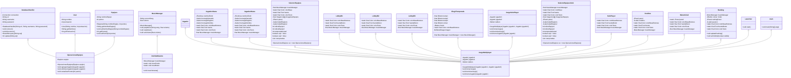

Readme para ir poniendo los avances del proyecto

```mermaid
classDiagram
    class DatabaseHandler{
        -Connection connection
        -String url
        -String username
        -String password
        +DatabaseHandler(String url, String username, String password)
        +void connect()
        +void disconnect()
        +ResultSet query(String sql)
        +int update(String sql)
    }
    class User{
        -String nombre
        -int puntuacion
        +User(String nombre, int puntuacion)
        +String getNombre()
        +int getPuntuacion()
    }
    class Equipos{
        -String nombreEquipo
        -int puntos
        +Equipos(String nombreEquipo, int puntos)
        +String getNombreEquipo()
        +void setNombreEquipo(String nombreEquipo)
        +int getPuntos()
        +void setPuntos(int puntos)
    }
    class MusicManager{
        -String currentSong
        -float volume
        +MusicManager()
        +void playMusic(String song, float volume)
        +void stopMusic()
        +void setVolume(float volume)
    }
    class OperacionesEquipos{
        -Equipos equipo
        +OperacionesEquipos(Equipos equipo)
        +void agregarJugador(Jugador jugador)
        +void eliminarJugador(Jugador jugador)
        +void actualizarPuntos(int puntos)
    }
    class InterfazMaestra{
        +MusicManager musicManager
        +void crearVentana()
        +static void crearFondo
        +static void crearBoton
    }
    class JuegoMultiplayer{
        -Jugador jugador1
        -Jugador jugador2
        -Tablero tablero
        +JuegoMultiplayer(Jugador jugador1, Jugador jugador2)
        +void iniciarJuego()
        +void terminarJuego()
        +void turnoJugador(Jugador jugador)
    }
    class Jugador1Gana{
        -JTextArea nombreField;
        -JLabel mensajeGanador;
        -JLabel mensajeRegistro;
        -JLabel mensajeNombre;
        +static final Color colorBaseBotones 
        +static final Font fuente
        +static final Color colorTexto
        -final MusicManager musicManager 
    }
    class Jugador2Gana{
        -JTextArea nombreField;
        -JLabel mensajeGanador;
        -JLabel mensajeRegistro;
        -JLabel mensajeNombre;
        +static final Color colorBaseBotones 
        +static final Font fuente
        +static final Color colorTexto
        -final MusicManager musicManager 
    }
    class SelectorEquipos{
        +OperacionesEquipos oe = new OperacionesEquipos()
        -final MusicManager musicManager 
        +static final Color colorBase 
        +static final Font fuente 
        +static final Color colorTexto 
        -final ImageIcon[][] imagenesEquipos
        -JPanel panel;
        -JLabel labelEquipo1;
        -JLabel labelEquipo2
        int indiceEquipo1
        int indiceEquipo2
        int temporadaActual
        boolean eq1 = false
        boolean eq2 = false
        List<List<Equipos>> temporadas
    }
    class LobbyIE1{
        +static final Color colorBaseBotones 
        +static final Font fuenteBoton 
        +static final Color colorTexto 
        -final MusicManager musicManager
    }
    class LobbyIE2{
        +static final Color colorBaseBotones 
        +static final Font fuenteBoton 
        +static final Color colorTexto 
        -final MusicManager musicManager
    }
    class LobbyIE3{
        +static final Color colorBaseBotones 
        +static final Font fuenteBoton 
        +static final Color colorTexto 
        -final MusicManager musicManager
    }
    class ElegirTemporada{
        -final JButton temp1
        -final JButton temp2
        -final JButton temp3
        -final JButton volver
        -JButton fondo
        +static final Color colorBaseBotones
        -BufferedImage imagen
        -final MusicManager musicManager = new MusicManager()
    }
    class JuegoSoloPlayer{
        -Jugador jugador1
        -Jugador jugador2
        -Tablero tablero
        +JuegoMultiplayer(Jugador jugador1, Jugador jugador2)
        +void iniciarJuego()
        +void terminarJuego()
        +void turnoJugador(Jugador jugador)
    }
    class SelectorEquiposSolo{
        +OperacionesEquipos oe = new OperacionesEquipos()
        -final MusicManager musicManager 
        +static final Color colorBase 
        +static final Font fuente 
        +static final Color colorTexto 
        -final ImageIcon[][] imagenesEquipos
        -JPanel panel;
        -JLabel labelEquipo1;
        -JLabel labelEquipo2
        int indiceEquipo1
        int indiceEquipo2
        int temporadaActual
        boolean eq1 = false
        boolean eq2 = false
        List<List<Equipos>> temporadas
    }
    class SoloPlayer{
        +static final Color colorBaseBotones
        +static final Font fuenteBoton 
        +static final Color colorTexto 
        -final MusicManager musicManager 
    }
    class Creditos{
        -JPanel panel;
        -JLabel creditos;
        +static final Color colorBaseBotones 
        +static final Font fuente 
        +static final Color colorTexto 
        -MusicManager musicManager
    }
    class MenuInicial{
        +static JPanel panel
        +static final Color colorBaseBotones
        +static final Font fuenteBoton
        +static final Color colorTexto
        -final MusicManager musicManager
    }
    class Ranking{
        -MusicManager musicManager 
        -JButton volver, fondo
        -JPanel rankingPanel
        -JLabel puesto1
        +static final Color colorBaseBotones
        +static final Font fuenteBoton
        +static final Color colorTexto
        +void updateRanking()
        +void setVisible(boolean visible)
    }
    class Launcher{
        +void start()
    }
    class main{
        +void main(String[] args)
    }
    
    
    DatabaseHandler <|-- OperacionesEquipos
    User <|-- OperacionesEquipos
    Equipos <|-- OperacionesEquipos
    MusicManager <|-- InterfazMaestra
    Jugador <|-- JuegoMultiplayer
    Jugador1Gana <|-- JuegoMultiplayer
    Jugador2Gana <|-- JuegoMultiplayer
    SelectorEquipos <|-- JuegoMultiplayer
    LobbyIE1 <|-- JuegoMultiplayer
    LobbyIE2 <|-- JuegoMultiplayer
    LobbyIE3 <|-- JuegoMultiplayer
    ElegirTemporada <|-- JuegoMultiplayer
    JuegoSoloPlayer <|-- JuegoMultiplayer
    SelectorEquiposSolo <|-- JuegoMultiplayer
    SoloPlayer <|-- JuegoMultiplayer
    Creditos <|-- JuegoMultiplayer
    MenuInicial <|-- JuegoMultiplayer
    Ranking <|-- JuegoMultiplayer
    Launcher <|-- JuegoMultiplayer
    main <|-- JuegoMultiplayer
    
    
    
    
    
```