# PENALTY ELEVEN

## Desarrollado por:

- [Esteban Miguel Montes Adraz]
- [Pedro Piñeiro Ordax]

### Descripción

Penalty Eleven es un juego de fútbol en el que se enfrentan dos equipos en una tanda de penaltis. El juego cuenta con un
modo multijugador y un modo para un solo jugador que llegará en próximas actualizaciones. En el modo multijugador, dos
jugadores se enfrentan en una tanda de
penaltis. En el modo para un solo jugador, el jugador se enfrenta a la máquina en una tanda de penaltis. El juego cuenta
con un sistema de temporadas en el que se pueden seleccionar diferentes temporadas y equipos. El juego cuenta con un
sistema de ranking en el que se pueden ver los mejores jugadores.

### Objetivos

El objetivo de este proyecto es desarrollar un juego de fútbol en el que se enfrenten dos equipos en una tanda de
penaltis. Para ello contaremos con varias interfaces gráficas que permitirán al usuario interactuar con el juego,
interfaces como un menú principal, un menú de selección de equipos,
un menú de rankings...
Queremos que quien pruebe el juego se divierta y disfrute de la experiencia de jugar a Penalty Eleven.

### Funcionalidades

El proyecto cuenta con las siguientes funcionalidades:

- Modo multijugador
- Modo para un solo jugador
- Sistema de temporadas
- Sistema de ranking
- Sistema de selección de equipos
- Sistema de música
- Sistema de sonidos (para botones y efectos)
- Sistema de puntuación
- Sistema de conexión a base de datos
- Sistema de registro de jugadores
- Sistema de actualización de puntuaciones

## Tecnologías

El proyecto ha sido desarrollado en Java y cuenta con las siguientes tecnologías:

- Java Swing
- Java AWT
- Java SQL
- Java IO
- Java ImageIO
- Java Sound
- Java Util
- Java Util List
- Java Util ArrayList
- Java Util Random
- Java Util Scanner
- Java Util Arrays
- Java Util Collections
- Java Util Comparator
- Java Util Map
- Java Util HashMap
- Java Util LinkedList
- Java Util Locale
- Java Util Timer

### Tiempo utiizado y planificación

El proyecto ha sido desarrollado en un tiempo aproximado de 1 meses. La planificación ha sido la siguiente:

## Semana 1:

Creación del proyecto y del repositorio en github. También creamos 3 ramas distintas para trabajar en paralelo, que
  son:
  - Rama de Pedro (Rama donde trabaja Pedro)
  - Rama de Esteban (Rama donde trabaja Esteban)
  - Rama de Premain (Rama donde se unen los cambios de Pedro y Esteban antes de subirlos a la main)
  También creamos la primera interfaz gráfica del juego, que es el menú principal y, sobre todo lo más importante,
  en clase decicidimos y discutimos el tema de nuestro proyecto, las bases que iba a tener, el nombre de este y como nos
  íbamos a asignar el trabajo, para no mezclarlo todo.

## Semana 2: 
En esta semana empezamos a trabajar en las demás interfaces gráficas, a pensar en las clases que podrían haber en el proyecto.
También empezamos a crear los `métodos externos` como la clase `Equipos` y la clase `OperacionesEquipos` que se encargan de
manejar los equipos y las operaciones que se pueden hacer con ellos.

## Semana 3:
Para esta semana ya teníamos prácticamente hechas todas las interfaces gráficas, así que empezamos a trabajar en la
codificación ya que sólo teníamos la parte de frontend, por así decirlo. Nos pusimos a trabajar
en el `SelectorEquipos` para que el usuario pudiera seleccionar los equipos que iban a jugar en la tanda de penaltis.
También en esta semana, estuvimos añadiendo pequeños detalles como música de fondo, sonidos para los botones, etc.
Por último, empezamos a trabajar en el `JuegoMultiplayer` que es la clase que se encarga de manejar el juego en sí.

## Semana 4:
En esta semana seguimos trabajando en el `JuegoMultiplayer` y en el `JuegoMultiplayer` añadiendo funcionalidades como 
la selección de portero, la selección de tiro, la selección de parada, la actualización de los botones, la actualización
del marcador, la actualización de los puntos, la actualización de los equipos, entre otras. También le dedcamos tiempo a 
la creación de la clase `Jugador1Gana` y `Jugador2Gana` que se encargan de mostrar un mensaje cuando un jugador gana la partida 
y empezamos a trabaja con la base de datos para guardar las puntuaciones de los jugadores con éxito.

## Semana 5:
En esta semana terminamos de trabajar en el `JuegoMultiplayer` y en el `JuegoMultiplayer` añadiendo detalles como que se mantengan los escudos
que escogiste en el `SelectorEquipos`, que se mantenga el nombre del equipo que escogiste en el `SelectorEquipos`, que se mantenga el nombre del equipo y 
estuvimos conectando la base de datos con la clase `Ranking` para que en esta clase se muestre los jugadores con mayor número de victorias ordenados de mayor a menor.
En esta semana estuvimos añadiendo detalles finales al proyecto y corrigiendo errores que encontramos en el camino.

## Que estamos haciendo ahora mismo:
Ahora mismo estamos trabajando en hacer que las interfaces se vean más bonitas y agradables y corrigiendo errores
que antes no nos habíamos dado cuenta de que existían. El proyecto está prácticamente terminado y estamos muy contentos con
el trabajo de estas semanas y sobre todo del trabajo final. Sin duda, cogeremos este proyecto para más adelante y seguiremos mejorándolo con
nuestros conocimientos.

# Diagramas
## Diagrama de clases

```mermaid
classDiagram
    class DatabaseHandler {
        -Connection connection
        -String url
        -String username
        -String password
        +DatabaseHandler(String url, String username, String password)
        +void connect()
        +void disconnect()
        +ResultSet query(String sql)
        +int update(String sql)
    }
    class User {
        -String nombre
        -int puntuacion
        +User(String nombre, int puntuacion)
        +String getNombre()
        +int getPuntuacion()
    }
    class Equipos {
        -String nombreEquipo
        -int puntos
        +Equipos(String nombreEquipo, int puntos)
        +String getNombreEquipo()
        +void setNombreEquipo(String nombreEquipo)
        +int getPuntos()
        +void setPuntos(int puntos)
    }
    class MusicManager {
        -String currentSong
        -float volume
        +MusicManager()
        +void playMusic(String song, float volume)
        +void stopMusic()
        +void setVolume(float volume)
    }
    class OperacionesEquipos {
        -Equipos equipo
        +OperacionesEquipos(Equipos equipo)
        +void agregarJugador(Jugador jugador)
        +void eliminarJugador(Jugador jugador)
        +void actualizarPuntos(int puntos)
    }
    class InterfazMaestra {
        +MusicManager musicManager
        +void crearVentana()
        +static void crearFondo
        +static void crearBoton
    }
    class JuegoMultiplayer {
        -static final int NUM_PENALES
        -int turno
        -int penalesRestantes1
        -int penalesRestantes2
        -int aciertos1
        -int aciertos2
        -int[] tiroActual
        -boolean jugador1Tira
        -boolean seleccionPortero
        -int[] porteroSeleccion
        -int seleccionPorteroCount
        -JButton[][] botonesTiro1
        -JButton[][] botonesParada1
        -JButton[][] botonesTiro2
        -JButton[][] botonesParada2
        +static final Color colorBaseBotones
        +static final Font fuenteBoton
        +static final Color colorTexto
        -final MusicManager musicManager
        -JButton accionBoton
        -JButton seguirBoton
        -final JButton[][] botones
        -JLabel marcadorLabel
        - JLabel estadoLabel
        -java.util.List<String> canciones
        -int currentSongsIndex
        -Equipos equipoSeleccionado1;
        -ImageIcon escudoEquipoSeleccionado1;
        -Equipos equipoSeleccionado2;
        -ImageIcon escudoEquipoSeleccionado2;
        -JLabel equipo1Label;
        -JLabel escudo1Label;
        -JLabel equipo2Label;
        -JLabel escudo2Label;
        +void marcarTiro(int x, int y)
        +void dispose()
        +void seleccionarParada(int x, int y)
        +void ocultarTiro()
        +void procesarTurno()
        +void mostrarResultados()
        +void setBotonesContentAreaFilled(boolean filled)
        +void actualizarBotonesTecnicas()
        +void actualizarMarcador()
        +void resetearBotones()
        +void playNextSong()
        +void determinarGanador()
        +void muerteSubita()
        +class ImageLabel
        +BufferedImage scaleImage(BufferedImage source, int width, int height)
    }
    class Jugador1Gana {
        -JTextArea nombreField;
        -JLabel mensajeGanador;
        -JLabel mensajeRegistro;
        -JLabel mensajeNombre;
        +static final Color colorBaseBotones
        +static final Font fuente
        +static final Color colorTexto
        -final MusicManager musicManager
    }
    class Jugador2Gana {
        -JTextArea nombreField;
        -JLabel mensajeGanador;
        -JLabel mensajeRegistro;
        -JLabel mensajeNombre;
        +static final Color colorBaseBotones
        +static final Font fuente
        +static final Color colorTexto
        -final MusicManager musicManager
    }
    class SelectorEquipos {
        +OperacionesEquipos oe
        -final MusicManager musicManager
        +static final Color colorBase
        +static final Font fuente
        +static final Color colorTexto
        -final ImageIcon[][] imagenesEquipos
        -JPanel panel;
        -JLabel labelEquipo1;
        -JLabel labelEquipo2
        -int indiceEquipo1
        -int indiceEquipo2
        -int temporadaActual
        -boolean eq1
        -boolean eq2
        -List<List<Equipos>> temporadas
    }
    class LobbyIE1 {
        +static final Color colorBaseBotones
        +static final Font fuenteBoton
        +static final Color colorTexto
        -final MusicManager musicManager
    }
    class LobbyIE2 {
        +static final Color colorBaseBotones
        +static final Font fuenteBoton
        +static final Color colorTexto
        -final MusicManager musicManager
    }
    class LobbyIE3 {
        +static final Color colorBaseBotones
        +static final Font fuenteBoton
        +static final Color colorTexto
        -final MusicManager musicManager
    }
    class ElegirTemporada {
        -final JButton temp1
        -final JButton temp2
        -final JButton temp3
        -final JButton volver
        -JButton fondo
        +static final Color colorBaseBotones
        -BufferedImage imagen
        -final MusicManager musicManager = new MusicManager()
    }
    class JuegoSoloPlayer {
        -Jugador jugador1
        -Jugador jugador2
        -Tablero tablero
        +JuegoMultiplayer(Jugador jugador1, Jugador jugador2)
        +void iniciarJuego()
        +void terminarJuego()
        +void turnoJugador(Jugador jugador)
    }
    class SelectorEquiposSolo {
        +OperacionesEquipos oe = new OperacionesEquipos()
        -final MusicManager musicManager
        +static final Color colorBase
        +static final Font fuente
        +static final Color colorTexto
        -final ImageIcon[][] imagenesEquipos
        -JPanel panel;
        -JLabel labelEquipo1;
        -JLabel labelEquipo2
        int indiceEquipo1
        int indiceEquipo2
        int temporadaActual
        boolean eq1 = false
        boolean eq2 = false
        List<List<Equipos>> temporadas
    }
    class SoloPlayer {
        +static final Color colorBaseBotones
        +static final Font fuenteBoton
        +static final Color colorTexto
        -final MusicManager musicManager
    }
    class Creditos {
        -JPanel panel;
        -JLabel creditos;
        +static final Color colorBaseBotones
        +static final Font fuente
        +static final Color colorTexto
        -MusicManager musicManager
    }
    class MenuInicial {
        +static JPanel panel
        +static final Color colorBaseBotones
        +static final Font fuenteBoton
        +static final Color colorTexto
        -final MusicManager musicManager
    }
    class Ranking {
        -MusicManager musicManager
        -JButton volver, fondo
        -JPanel rankingPanel
        -JLabel puesto1
        +static final Color colorBaseBotones
        +static final Font fuenteBoton
        +static final Color colorTexto
        +void updateRanking()
        +void setVisible(boolean visible)
    }
    class Launcher {
        +void start()
    }
    class main {
        +void main(String[] args)
    }

    DatabaseHandler <|-- OperacionesEquipos
    User <|-- OperacionesEquipos
    Equipos <|-- OperacionesEquipos
    MusicManager <|-- InterfazMaestra
    Jugador <|-- JuegoMultiplayer
    Jugador1Gana <|-- JuegoMultiplayer
    Jugador2Gana <|-- JuegoMultiplayer
    SelectorEquipos <|-- JuegoMultiplayer
    LobbyIE1 <|-- JuegoMultiplayer
    LobbyIE2 <|-- JuegoMultiplayer
    LobbyIE3 <|-- JuegoMultiplayer
    ElegirTemporada <|-- JuegoMultiplayer
    JuegoSoloPlayer <|-- JuegoMultiplayer
    SelectorEquiposSolo <|-- JuegoMultiplayer
    SoloPlayer <|-- JuegoMultiplayer
    Creditos <|-- JuegoMultiplayer
    MenuInicial <|-- JuegoMultiplayer
    Ranking <|-- JuegoMultiplayer
    Launcher <|-- JuegoMultiplayer
    main <|-- JuegoMultiplayer
```

## Diagrama de secuencia

    
